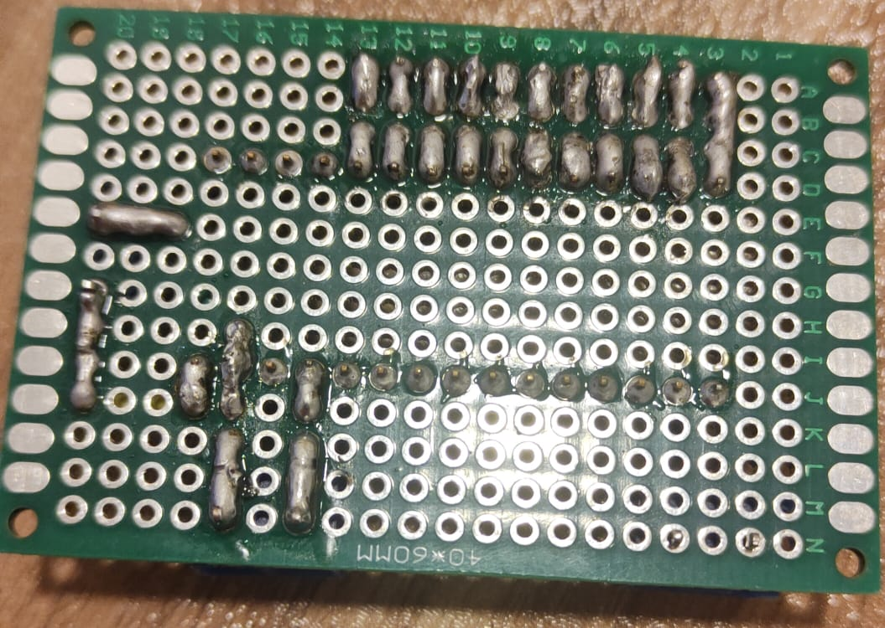

<h1>HARDWAER</h1>

1 × Arduino Nano

2 × DC Motor JGB37-520

4 × Ultrasonic distance sensor HY-SRF05

2 × QTR-1A Infrared Sensor

<h1>ELECTRONIC BOARD</h1>

<table>
  <tr>
    <td></td>
    <td></td>
  </tr>
</table>

